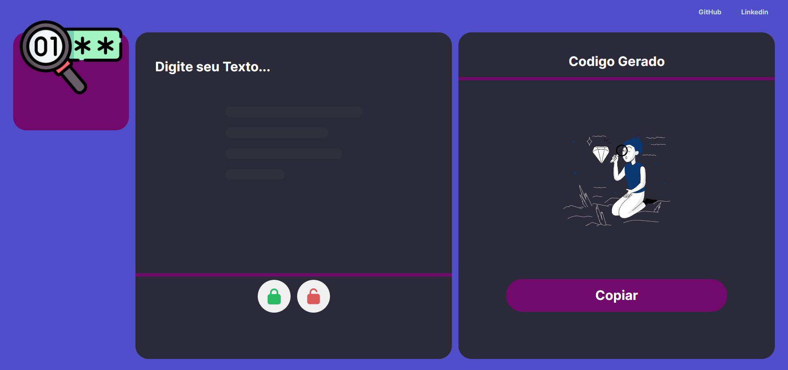
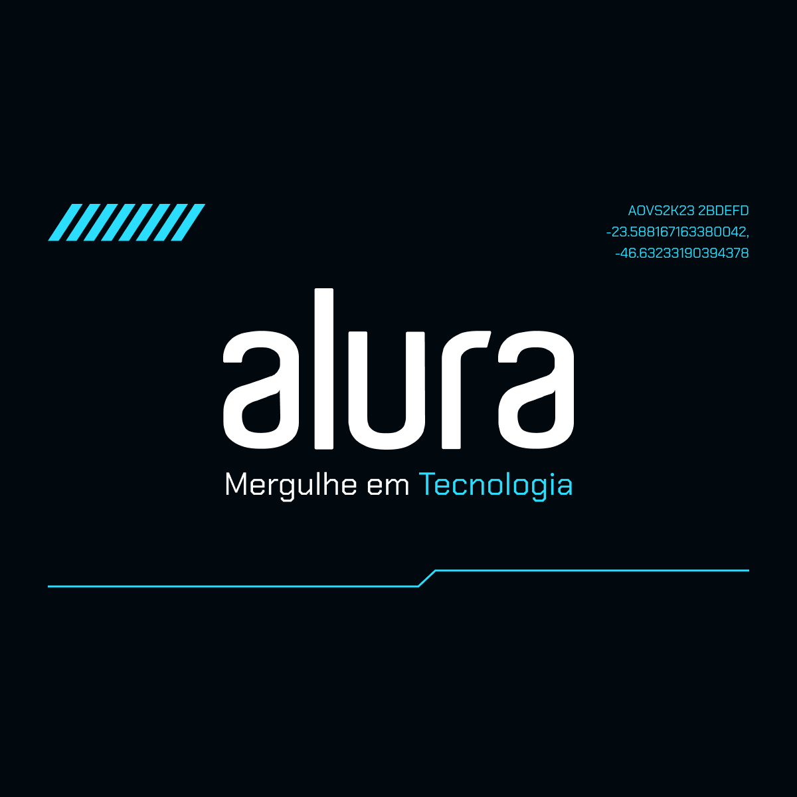

# CripTexto

## Descrição
O **codifier** é uma aplicação web desenvolvida para criptografar e descriptografar textos.

## Vizualizar Projeto
[Entre aqui para Vizualizar 📦]()

## Desafio da Alura

## Índice
1. [Descrição](#descrição)
2. [Funcionalidades](#funcionalidades)
3. [Tecnologias Utilizadas](#tecnologias-utilizadas)
4. [Licença](#licença)

## Figma do Projeto 

[Projeto Original🔰](https://www.figma.com/design/tvFEYhVfZTjdJ5P24RGV21/Alura-Challenge---Desafio-1---L%C3%B3gica?node-id=0-1&t=IUGPCMTEk0xgJMEC-1)

 

## Funcionalidades

- **Criptografar e Descriptografar:** Permite aos usuários inserir texto e realizar operações de criptografia e descriptografia utilizando métodos seguros.

## Tecnologias Utilizadas

- **Front-end:** HTML, CSS, JavaScript (ES6+)

## Fonts 
>[!TIP]
>`https://fonts.googleapis.com/css2?family=Inter:wght@100..900&display=swap `

## Licença

Este projeto está licenciado sob a [Licença MIT](LICENSE).
